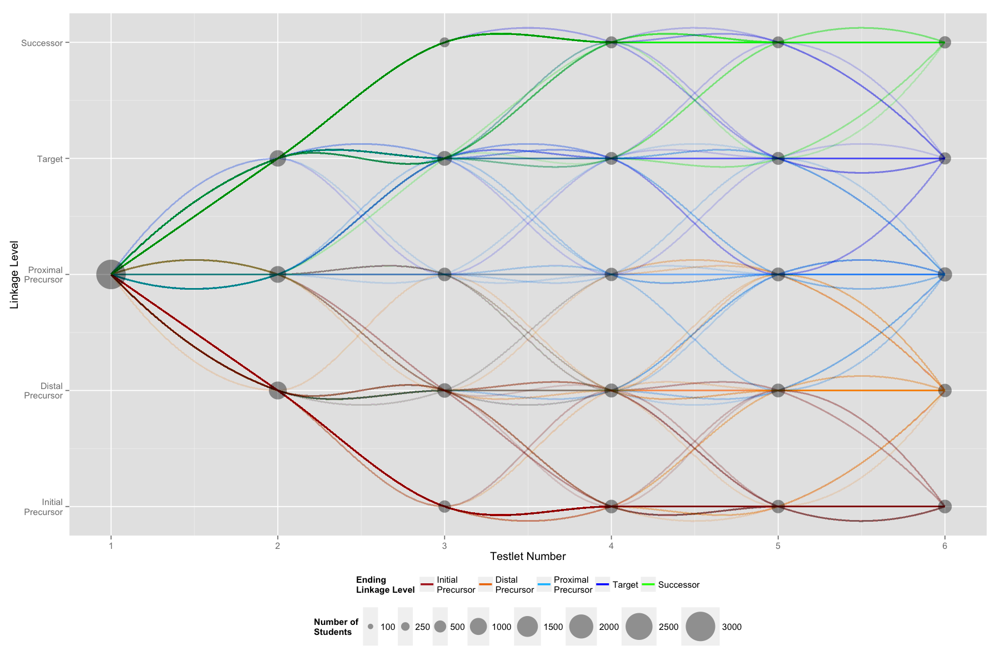

# Dynamic Assessment Routing

Published version: https://doi.org/10.1111/emip.12114 (pp. 33)

The Dynamic Learning Maps (DLM) alternate assessment is an adaptive assessment that uses a dynamic routing system to direct students to questions intended to be accessible at different levels of cognitive complexity.
Throughout the testing process, students are directed to testlets containing more or less complex content based on their performance on previous testlets.

DLM consists of multiple testlets, with adaptation occurring after each testlet.
Additionally, there are five levels of cognitive complexity, or linkage levels (initial precursor, distal precursor, proximal precursor, target, and successor) related to a student’s proximity to the target ability.
This graph visualizes the different paths that simulated students starting at the proximal precursor level took through a simulated DLM assessment.
The x-axis shows the testlet number, and y-axis represents the linkage level of the testlet.
The area of the points is proportional to the number of students that were testing at a given linkage level in the corresponding testlet.
The transparency of the lines represents how common that particular pattern of adaptation was during the assessment (i.e., the darker the line, the more students followed that pattern).
Finally, the color of the line represents the location of student at the end of the assessment.

This type of visualization allows the assessment designer to get a better idea of how students are moving through the assessment, rather than simply examining where individuals are ending.
Additionally, this type of graph can provide information about the assessment itself.
In DLM for example, specific content is assigned to each testlet.
Thus, seeing large amount of adaptation following one testlet could indicate that that content may be written at a difficulty level that is inconsistent with the content presented in other testlets.

