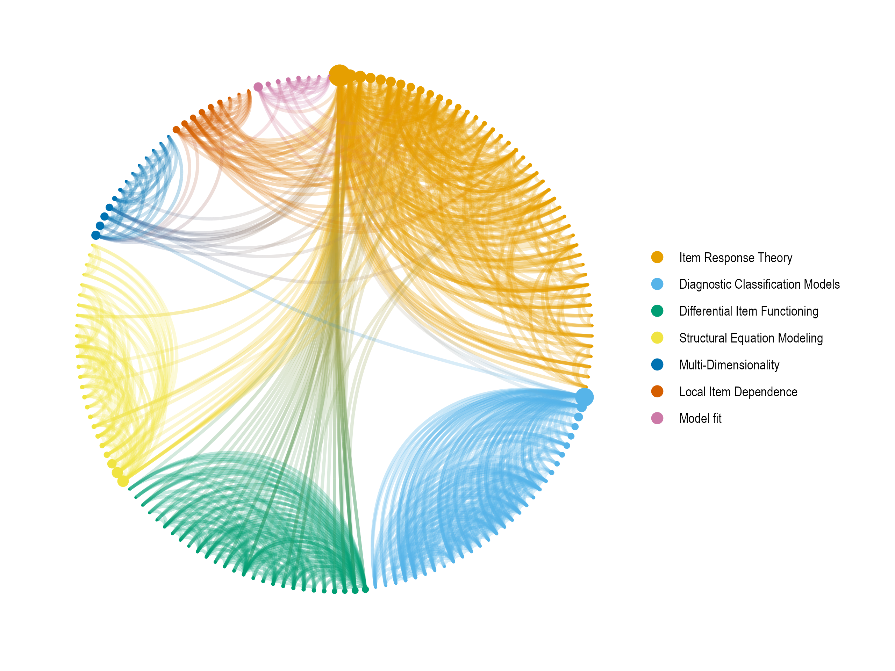

# 20 Years of Research in Educational Measurement

Published version: https://doi.org/10.1111/emip.12348 (cover), https://doi.org/10.1111/emip.12435 (description)

Co-citation networks are one method for showing the inter-connected relationships of articles in the research literature.
Two articles are connected if they were both cited together in the same paper.
Based on the patterns of connections, a network can be generated and neighborhoods of related articles identified.
For this network, articles published in *Applied Measurement in Education*, *Applied Psychological Measurement*, *Educational and Psychological Measurement*, *Educational Measurement: Issues and Practice*, *Journal of Educational and Behavioral Statistics*, *Journal of Educational Measurement*, or *Psychometrika*, between 2000 and 2019 were gathered from the Web of Science data base.
This resulted in 4,093 articles that cited a total of 56,531 other articles.
In order for a citation pair to be included, each citation had to be cited at least 15 times across all articles, and the pair had to be cited together at least 5 times.
With these restrictions, the network consists of 157 citations and 931 connections.
These represent the most common citations over the past 20 years.
Finally, the Louvain clustering algorithm was applied to the network to identify notable groups of inter-related citations.

As might be expected, the largest clusters are made up of citations regarding Item Response Theory, Diagnostic Classification Models, Differential Item Functioning, and Structural Equation Modeling.
There are also three smaller clusters with citations related to multi-dimensional assessment, local item dependence, and model fit.
Notably, citations related to diagnostic classification models are relatively isolated from the other clusters, with only a few connections to citations outside of the cluster.
The sample of selected journals is certainly not exhaustive, but this network provides an overview of how the research literature is related, as well as how large-grain clusters relate to other clusters.
The full data set and code for generating the network visualization are available at https://github.com/wjakethompson/edmeas-network.

